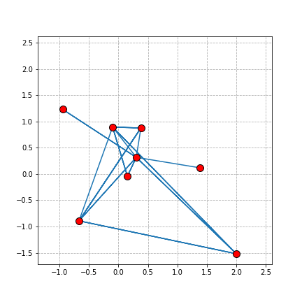

# pytorch-simple-projects
Small funny projects made with PyTorch

## simple_linear_model
Single-layer perceptron which can be used as a start point

## force_layout
Building force layout for arbitary graphs. Works by looking
for minimal energy of repulsive particles system, with some
of particles connected with springs.

#### Example:

